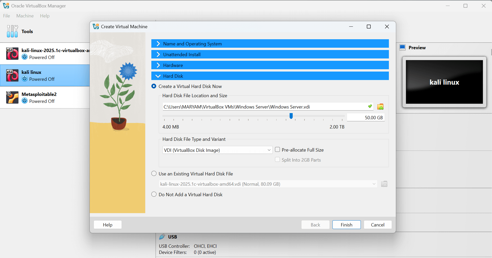
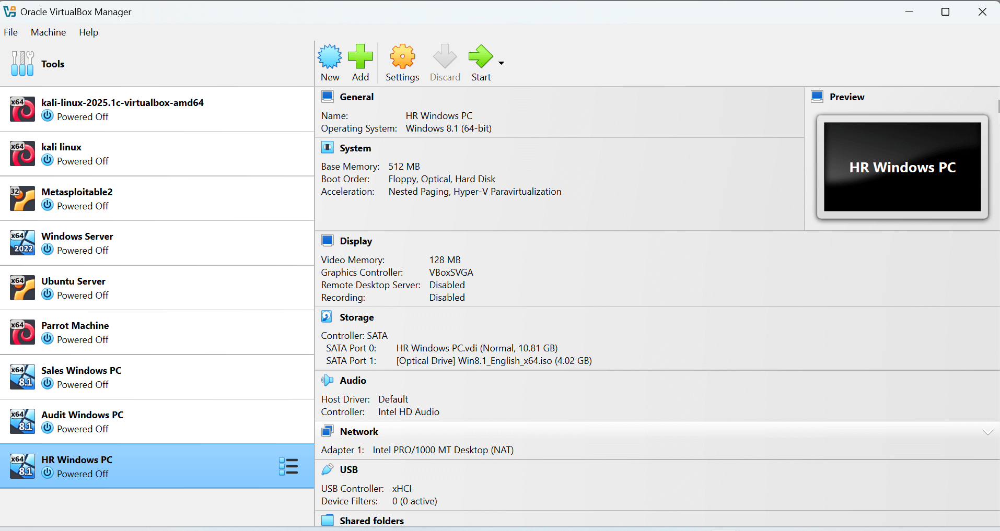
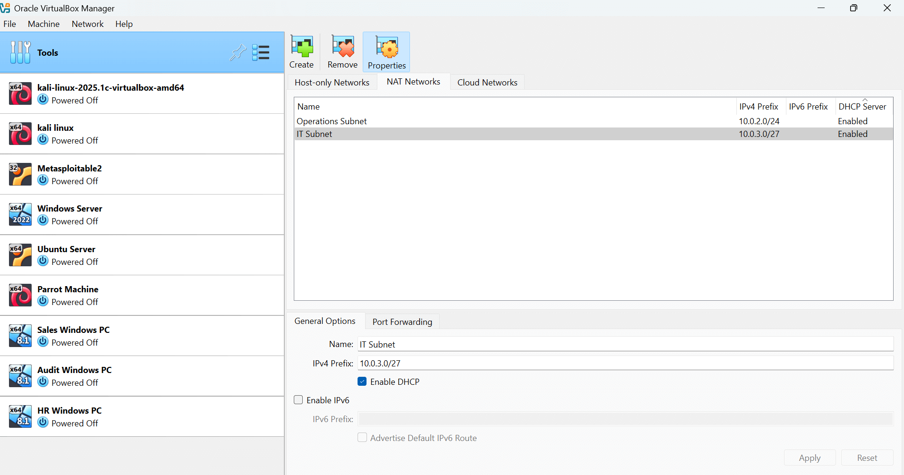
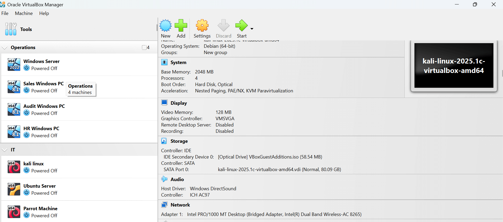
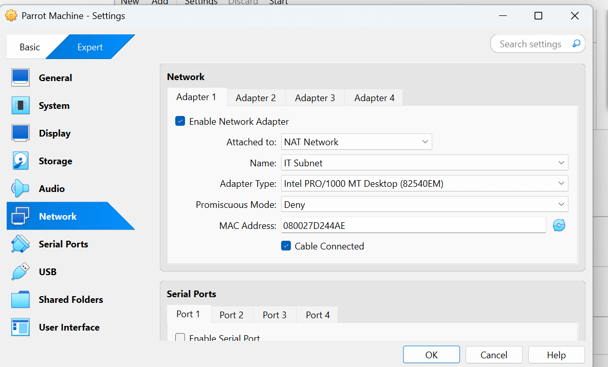
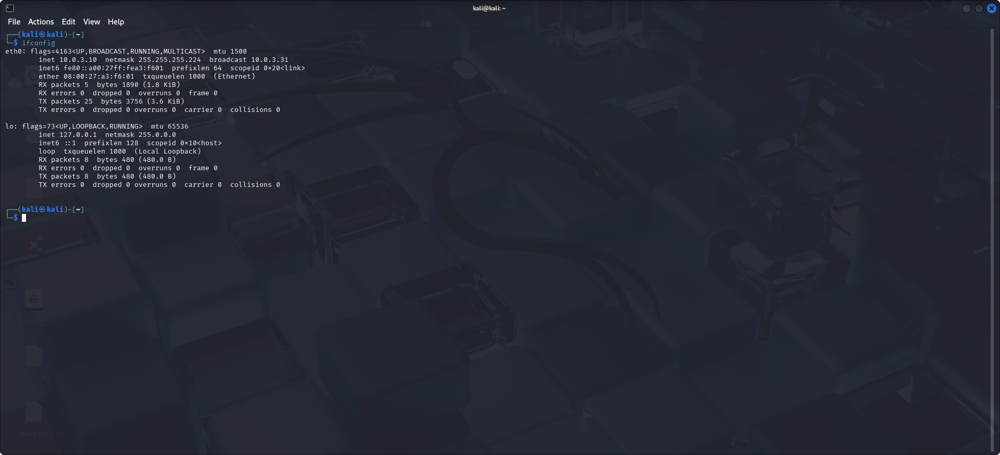

#  Cybersecurity Home Lab Setup

## Introduction

A home security lab is one of the best ways to gain hands-on cybersecurity experience.  
It allows you to **experiment, simulate attacks, and test defensive strategies** in a safe, isolated environment without risking real systems.  
By building your own lab, you can strengthen your networking knowledge, improve troubleshooting skills, and practice using industry-standard security tools — all from home.

In this guide, I set up a virtualized network environment with multiple machines, servers, and subnets.  
This lab will serve as the foundation for penetration testing, incident response simulations, and other future projects.

---

##  Network Topology Simulation

  
We will simulate a network topology consisting of:  
- Sales PC  
- HR PC  
- Audit PC  
- Windows Server  
- Ubuntu Server  
- Kali Machine  
- Parrot Machine  
- Firewall, Router, and Internet  

All will be set up virtually in **VirtualBox**.

---

##  Installing the Virtual Machines

  
Download all the required virtual machines and install them in VirtualBox.  
For the Sales, HR, and Audit PCs, you can use the same **Windows 8 ISO** file.

---

## Creating Operations and IT Subnets

  
1. In VirtualBox, go to **Tools** → **Network**.  
2. Click **NAT Network** (should be blank).  
3. Click **Create**, rename it to `Operations Subnet`, and click **Apply**.  
4. Repeat the process to create `IT Subnet`.

---

##  Grouping the Machines

  
- Group **Windows Server**, **Sales PC**, **Audit PC**, and **HR PC** into a group called **Operations**.  
- Group **Kali Machine**, **Ubuntu Server**, and **Parrot Machine** into a group called **IT**.

---

##  Assigning Subnets to Groups

  
- For the **Operations group**, open each machine's settings → **Network** → change **NAT** to **NAT Network** → select **Operations Subnet**.  
- Repeat for the **IT group**, but assign them to the **IT Subnet**.

---

## Configuring the Windows Server

  
  
  
  
1. Install Windows Server and set a secure password.  
2. Press **Ctrl+Alt** (via Input → Keyboard in VirtualBox) to unlock.  
3. Log in with your password.

---

## Checking the Server IP Address

  
Open **CMD** and run:  
```bash
ipconfig

---
## Lab 11: Installing Parrot OS


Installation process for **Parrot OS** — a security-focused Linux distribution we’ll use for penetration testing.

---

## Lab 12: Installing Kali Linux


We install **Kali Linux**, which comes with a large set of pre-installed penetration testing tools.

---

## Lab 13: Installing Ubuntu Server


Setting up **Ubuntu Server** to act as our target environment for various security experiments.

---

## Lab 14: Configuring the Network


We configure all virtual machines to be on the same **Host-Only Network**, allowing them to communicate securely without internet exposure.

---

## Lab 15: VM Overview


Final check of all installed operating systems before we begin testing network configurations and security tools.

---

## Lab 16: Starting Virtual Machines


Here, we start up our **Parrot**, **Kali**, and **Ubuntu Server** virtual machines.

---

## Lab 17: Checking IP Addresses


We use the `ifconfig` command inside each VM to display their IP addresses.

---

## Lab 18: Sequential IP Addresses


Notice that the IP addresses are in sequence, showing proper network configuration within the lab environment.

---

## Lab 19: Project Completion


That brings us to the end of our **Home Security Lab**.  
This is just the beginning — we will use this lab to simulate attacks, perform penetration testing, and much more.  
Stay tuned for my upcoming **Cloud Security Lab Project**.
